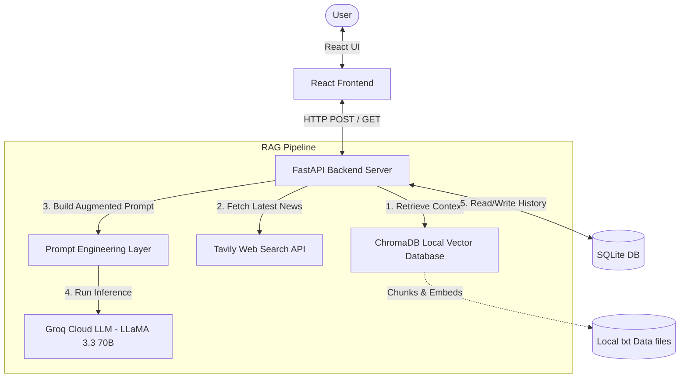

# SportIQ AI – Intelligent RAG Sports Quiz Generation Agent

SportIQ AI is a Retrieval-Augmented Generation (RAG) AI agent that generates highly personalized, difficulty-tuned sports quizzes on demand. By combining local structured knowledge (ChromaDB), real-time internet search (Tavily), and low-latency LLM inference (via Groq), SportIQ provides accurate and context-verifiable quizzes across multiple sports at Easy, Medium, and Hard difficulty levels.

---

## 🏗️ Architecture Diagram

Below is the architectural flow of the RAG pipeline when a user requests a quiz:



---

## ✨ Features

- **Multi-Source Retrieval (Local + Web RAG)**: Combines static local data facts with live web search snippets to ensure trivia is both historically accurate and up-to-date.
- **Difficulty-Tuned Questions**: Generates different question types depending on selection:
  - **Easy**: Well-known basic facts, famous players, and legendary wins.
  - **Medium**: Statistical milestones and notable records.
  - **Hard**: Specific game rules, match situations, and niche trivia.
- **Answer Validation & Explanations**: Every question includes a context-verified explanation that is only shown to the user upon clicking an option.
- **Quiz History Log**: Automatically caches previously generated quizzes in a local SQLite database for quick review.
- **Modern Obsidian & Amber UI**: A highly responsive dark-charcoal interface with glowing amber gradients, micro-animations, and glassmorphic card overlays.

---

## 💻 Tech Stack

- **Frontend**: React (18.3.1), Axios, Vanilla CSS (Glassmorphism & animations)
- **Backend Framework**: FastAPI (0.111.0), Uvicorn
- **RAG & Search**: LangChain (0.2.6), ChromaDB (0.5.0), Sentence-Transformers (`all-MiniLM-L6-v2`), Tavily Search API
- **LLM Provider**: Groq Cloud SDK (LLaMA 3.3 70B Versatile model)
- **Database**: SQLite (built-in)

---

## 📁 Folder Structure

```text
SportIQ-AI/
├── backend/
│   ├── main.py           # FastAPI routes & SQLite setup
│   ├── agent.py          # Groq LLM integration & prompt flow
│   ├── rag.py            # Local ChromaDB + Web search merger
│   ├── chroma_store.py   # ChromaDB indexing & semantic retrieval
│   ├── search.py         # Tavily API crawler
│   ├── prompts.py        # System prompts and difficulty tuning
│   ├── requirements.txt  # Python requirements
│   └── .env.example      # Configuration template
├── frontend/
│   ├── public/
│   ├── src/
│   │   ├── components/   # QuizCard & QuizControls components
│   │   ├── pages/        # Dashboard layout
│   │   ├── api.js        # Axios API callers
│   │   ├── index.css     # Premium dark theme styling
│   │   └── App.js
│   └── package.json      # Node requirements
├── data/                 # Local facts corpus (cricket, football, tennis)
└── README.md
```

---

## 🚀 Installation & Local Setup

### 1. Prerequisites
- **Python**: v3.11+
- **Node.js**: v20+
- **API Keys**: Groq API Key and Tavily Search API Key

### 2. Backend Setup
1. Open your terminal and navigate to the backend folder:
   ```bash
   cd backend
   ```
2. Create and activate a Python virtual environment:
   ```bash
   python -m venv .venv
   # Windows:
   .venv\Scripts\activate
   # macOS/Linux:
   source .venv/bin/activate
   ```
3. Install the dependencies:
   ```bash
   pip install -r requirements.txt
   ```
4. Configure your environment variables:
   - Copy `.env.example` to `.env`:
     ```bash
     cp .env.example .env
     ```
   - Open `.env` and fill in your keys:
     ```env
     GROQ_API_KEY=your_groq_api_key_here
     TAVILY_API_KEY=your_tavily_api_key_here
     ```
5. Start the backend server:
   ```bash
   python -m uvicorn main:app --host 127.0.0.1 --port 8000
   ```
   *Note: On first boot, the backend automatically initializes the `SentenceTransformer` model, reads `/data/*.txt` files, and index-builds ChromaDB.*

### 3. Frontend Setup
1. In a new terminal, navigate to the frontend folder:
   ```bash
   cd frontend
   ```
2. Install npm packages:
   ```bash
   npm install
   ```
3. Start the React development server:
   ```bash
   npm start
   ```
4. Access the web app at **[http://localhost:3000](http://localhost:3000)**.

---

## ☁️ Deployment Instructions

### Deploying the Backend (Render / Railway)
1. Push your project code to GitHub.
2. Link your repository to **Render** or **Railway**.
3. Choose Python environment, set the start command to:
   ```bash
   uvicorn main:app --host 0.0.0.0 --port $PORT
   ```
4. Add environment variables: `GROQ_API_KEY`, `TAVILY_API_KEY`, `CHROMA_DB_PATH=./chroma_store`.

### Deploying the Frontend (Vercel / Netlify)
1. Deploy the `frontend/` directory to **Vercel** or **Netlify**.
2. Configure the build command as `npm run build` and output directory as `build`.
3. Set the environment variable `REACT_APP_API_URL` to point to your live deployed backend URL.

---

## 🔮 Future Improvements
- **Document Uploader**: Allow users to drag-and-drop PDFs/CSVs/txt to expand the local database dynamically.
- **Leaderboard Integration**: Connect database history to individual users for score-tracking.
- **Multilingual Support**: Generate quizzes in Spanish, French, or Hindi using LLM translation layers.
